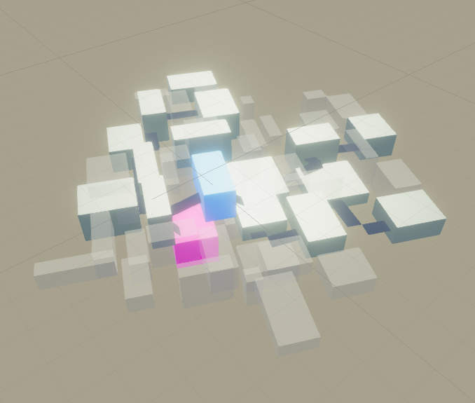
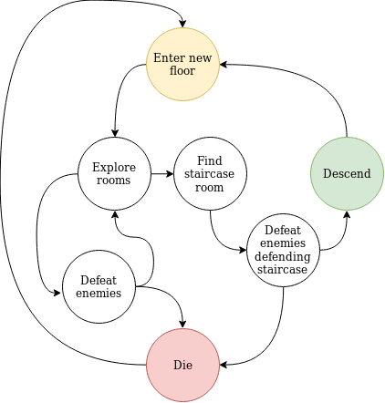
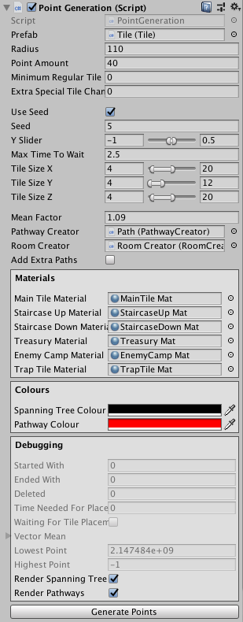

# Proc Gene <!-- omit in toc --> 

# Table of Contents <!-- omit in toc --> 
- [Introduction](#introduction)
- [Design Cycle](#design-cycle)
  - [Magic Circle](#magic-circle)
  - [User Experience](#user-experience)
  - [Storytelling](#storytelling)
  - [Player Type](#player-type)
  - [Themes](#themes)
  - [Mood](#mood)
  - [Setting](#setting)
  - [Boundaries](#boundaries)
  - [Game Characters](#game-characters)
- [Gameplay Design](#gameplay-design)
  - [MDA](#mda)
    - [Aesthetics](#aesthetics)
    - [Dynamics](#dynamics)
    - [Mechanics](#mechanics)
    - [Core Loop](#core-loop)
  - [Level Components](#level-components)
    - [Action](#action)
    - [Pacing](#pacing)
  - [Controls](#controls)
  - [Wireframe](#wireframe)
  - [Requirements](#requirements)
- [User tests](#user-tests)
  - [Generation User Interface](#generation-user-interface)
    - [Bart de Bever](#bart-de-bever)
- [Choices](#choices)
  - [Customizing Generation](#customizing-generation)
  - [Dungeon/Area Generation](#dungeonarea-generation)
  - [Algorithms](#algorithms)
    - [Minimum Spanning Tree](#minimum-spanning-tree)

# Introduction

In this document I will explain the choices I made during the creation of my game, Proc-Gene.

The goal of Proc-Gene is to create procedural content. The content being areas and items.

# Design Cycle

## Magic Circle

>*Magic Circle is the agreement of the player that they agree with the game rules*

The Magic Circle in Proc-Gene is something like this;

- Players can walk and jump around.
- Players can defeat enemies by hitting them until they die.
- Players can advance from room to room in order to explore new areas.
- Players can descend down stairs into a new floor.

## User Experience

>*What does the player experience while playing your game?*

The player will experience **Challenge** and **Discovery**.
This is achieved by making continually harder levels, which can be reached by exploring more and more content in the game.
My primary goal is to create a game which offers a ton of replayability, so the player can keep playing this without having the same experience twice.

## Storytelling

>*How is the story told to the player?*

The player can see a short cutscene before the game starts, explaining them what is going on and why they're inside a dungeon.

## Player Type

>*What type of player is the target audience of your game?*

The target audience for this game are basically all players that are into roguelikes. Besides that, I don't really have anything in mind.

## Themes

>*The overarching setting that relates to the game's mechanisms*  
*It is the goal of the User Experience Design*

The theme of my game will be an roguelike game with lots of random components.  
This fits well with my User Experience as this would increase the Discovery aspect since I could generate endless areas.

## Mood

>*How your game is presented to the player, what they feel, hear and see*

The mood of my game is going to be high fantasy, medieval and dark.  
I want to make my players feel a little uncomfortable and underpowered at the start. They should feel stronger and confident the longer they play.

## Setting

>*Influences your characters, back story, dialogs and other elements in your game, think genres*

The setting will be grim, dark, medieval and high-fantasy roguelike.

## Boundaries

>*What rules must the player follow*

I have thought of the following boundaries for my game;

- The player must stay above 0 health in order to stay alive.  
- In order to progress through the dungeon, the player must explore rooms and defeat enemies.
- The player can only descend down stairs, ascending isn't possible.
- The player can pickup items and use these as weapons.
- The player can only hold a specific amount of items in its inventory.

## Game Characters
  
Characters in my game will be very simple. Think something like a sphere with arms and legs.  
There will be very few characters, since the player is delving into a mostly unexplored dungeon.  
This influences the setting by adding grim and dark elements to it, seeing as you're entering never before seen areas.

# Gameplay Design

## MDA

### Aesthetics

The most important Kind of Fun for this game would be **Challenge**. It should be challenging to descend to the next floor, and it should get harder over time.  
After **Challenge**, **Discovery** also plays a big part of the fun in my game. The floors the player would explore should always differ from the floor before it.

### Dynamics

There are a few different play styles;

1. Rush towards the staircase room in order to minimize the timed difficulty.  
The player would end up with few items and have a hard time.
2. Explore some rooms and find many items before descending to the next floor.  
The player would end up with good items and have a good chance against most enemies on their floor.
3. Play slow and safe. The player would end up with a ton of items. Enemies will be a bit stronger than the player but since the player has a ton of items, they could have the upper hand.

### Mechanics

The player can move forwards, backwards, left and right, and jump. The player can also damage enemies by hitting it with their weapon.

The player can pick up items and put them in its inventory. This inventory can hold a limited amount of items, either based on amount or on weight.

Items in the inventory can be used as weapons, differing in damage dealt per hit.
The player should seek out the staircase room to descend into the next floor. This room is defended by enemies and must be defeated before the player can progress.

If the players' health drops below 1 the player dies and it's a game over.

### Core Loop

The core loop of the game is as follows;  

## Level Components

### Action  

The game has encounters in some rooms. These might be a few enemies scattered around or a few items lying on the ground or against the wall.

### Pacing

The pacing is largely dependant on the seed that the dungeon is generated with. It might be high action the entire time, or be a walk through the park.

I am going to try to find a good balance between the pacing, so all seeds will be enjoyable to play.

## Controls

| Input | State 1 | State 2 |
| :---: | ------- | :------ |
| **W** | Move forward | |
| **A** | Move left | |
| **S** | Move backward | |
| **D** | Move right | |
| **E** | Pick up | |
| **I** | Show Inventory | |
| **1 ~ 5** | Skills in Slot 1 ~ 5 | |
| **Space** | Jump | |
| **Shift** | Sprint | |
| **Escape** | Show Main Menu | Exit current menu |
| **Mouse Movement** | Move camera | Move cursor in menus |
| **Mouse Button 1** | Attack | |
| **Mouse Button 2** | Block | Zoom |

## Wireframe

## Requirements

| Requirement | Category | MoSCoW |  Done  |
| :---------- | :------: | :----: | :----: |
| Generation of content should be customizable | General | M | |
| Generation should be easy for the end user, like clicking a button | General | M |  |
| The generator should be able to create Dungeons | Dungeons | M | |
| The generator should be able to create Items | Items | M | |
| The generator should be able to create Monsters | Monsters | C | |
| The generated content should be showcased by a simple Roguelike game | General | M | |
| The player should be able to walk through the generated dungeons | Dungeons | M | |
| The player should be able to advance through dungeons | Dungeons | S | |
| Dungeons should scale in difficulty the deeper you go | Dungeons | M | |
| Difficulty should increase over time | Dungeon | S | |
| A boss should defend the stairway down so the player has to prove they're strong enough to descend | Dungeon | S | |

# User tests

## Generation User Interface

The goal of this user test was to see what people think of the user interface which is used to create a randomized dungeon.

The user interface looked like this when I was testing it;

The instructions I gave for the testers are;  
"Here's the user interface to create a new dungeon, look at all the options available and figure out what the options are"

### Bart de Bever

1. Make it clearer what certain things do.  
2. Divide stuff in sections, such as, this is about tiles, this is about paths, etc 
3. Add a bit of documentation about what this is.  
4. Add a piece of text telling the user that a new dungeon will only be generated if you press the Generate Points button  
5. Pathways looked weird, they looked to weird and sometimes went pretty much straight up.

# Choices

## Customizing Generation

In the end, I want other developers to be able to use the procedural generation script I am creating.
To make it more interesting for other developers, I want to add some customization options, such as setting the seed, changing stuff like room size, minimum amount of regular rooms it should have, what special rooms there are, the chance for special rooms, and a whole lot more.

I'm planning to create an EditorScript in order to make it easier on the eye, and easier to use.

## Dungeon/Area Generation

I've decided to followed [this article](https://www.gamasutra.com/blogs/AAdonaac/20150903/252889/Procedural_Dungeon_Generation_Algorithm.php) to make a prototype for my dungeon generation.

The image below showcases how the algorithm in the article creates a random dungeon;

1. Create rooms in random points.
2. Select the bigger rooms and connect them using **Delaunay Triangulation**.
3. Reduce the amount of connections using **Minimum Spanning Tree**.
4. Replace the connections with L-shaped corridors.
5. Incorporate smaller rooms into the corridors and create remaining corridors so all rooms are still connected.

The reason I chose to follow this article is because it went in depth about the stuff I wanted to learn, showed visuals which clearly showed what a certain step would do, and I really just wanted to start programming something.

There are also a few other sites that looked very interesting in regards to creating a prototype, which I'd like to read up and might make a quick prototype about;

- [Joris Dormans' Handcrafted Feel](http://ctrl500.com/tech/handcrafted-feel-dungeon-generation-unexplored-explores-cyclic-dungeon-generation/)  
Describes how procedural dungeons can be created while giving a handcrafted feel, making players believe the dungeon isn't created by a algorithm.
- [Bob Nystrom: Rooms and Mazes](https://journal.stuffwithstuff.com/2014/12/21/rooms-and-mazes/)  
Showcases how a dungeon can be generated by generating a maze, some random rooms and creating paths between them. After the entire maze has a path, it removes unneeded paths, which creates a big dungeon with a few paths between rooms.
- [Mapgen: Cellular Automata](https://www.gridsagegames.com/blog/2014/06/mapgen-cellular-automata/)  
Showcases how Cellular Automata can be used to create natural looking areas.

## Algorithms

### Minimum Spanning Tree

When I was busy with my dungeon generation, trying to connect the main rooms with their shortest route, I came across [Minimum Spanning Tree](https://en.wikipedia.org/wiki/Minimum_spanning_tree). I found two algorithms; [Prim's algorithm](https://en.wikipedia.org/wiki/Prim's_algorithm) and [Kruskal's algorithm](https://en.wikipedia.org/wiki/Kruskal's_algorithm) which were exactly what I needed. These two differed in that Kruskal's performed better for sparse graphs and Prim's performed better at dense graphs which has more edges than vertices ([Source](https://www.quora.com/What-is-the-difference-in-Kruskals-and-Prims-algorithm)).

Between those two Kruskal's fitted better with my generation, since the points I use to create a graph are pretty far apart.